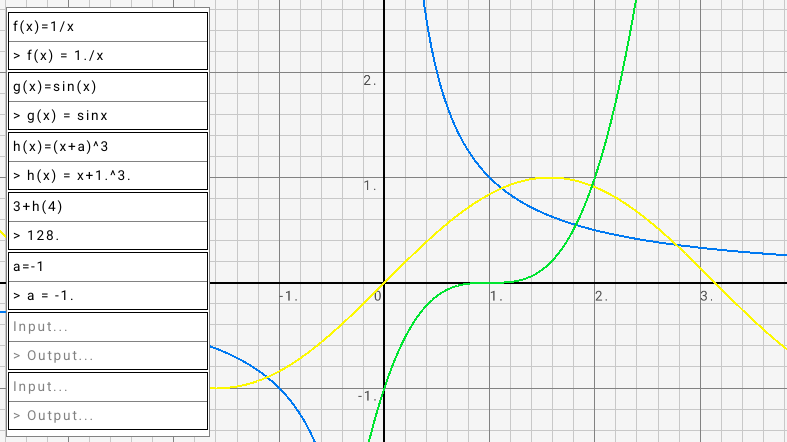

# graphic-calc

A graphical calculator built with OCaml and Raylib. 
Partly based on my other project 'functional-calculator'.

## Usage
- Compute mathematical expressions using standard operators : +, -, /, *, ^.
- Define constants : "a = 10", "hello = 20".
- Built in constants : pi, e.
- Define functions with an arbitrary number of arguments: "f(x) = x", "g(x,y) = (x*y)^2".
- Built in functions : sin, cos, tan, log, exp.
- To draw a function to the screen simply define a function that accepts a single argument : "f(x) = 3x^2", "g(x) = sin(x)".
Note that the name of the argument isn't relevant.

## Install
Pre-build binaries for linux and windows can be found in the releases.

